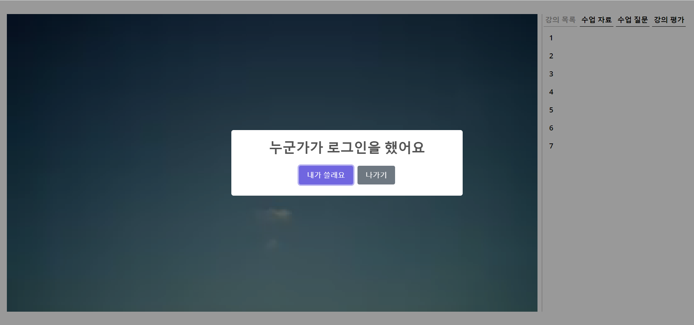
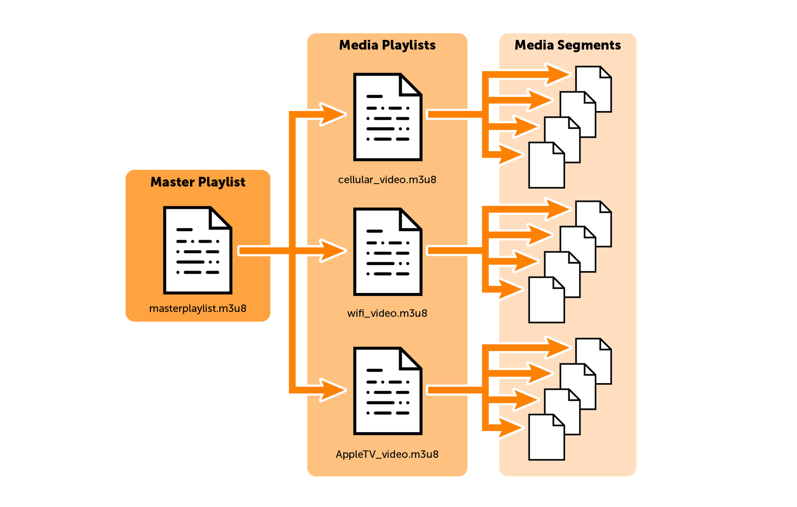
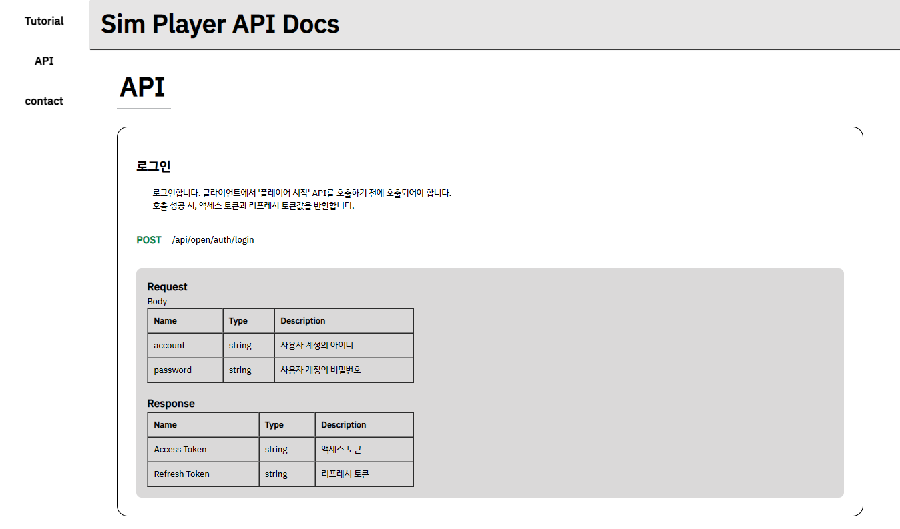

# Simplayer 

---
Simplayer는 오픈 API 형태로 제공되는 온라인 학습 미디어 플레이어입니다.

[데모 영상](http://localhost) (준비중)   
[오픈 API 문서](https://jaeheon-sim.github.io/simplayer_apidocs/)


## 프로젝트 배경

---
본 프로젝트는 2022-2학기 산학협력 프로젝트에 참여하여 진행하였습니다.  
현재 클라이언트 플랫폼인 '기사친구'가 사용하는 플레이어의 문제점은 다음과 같습니다.
- 스크롤 바 조작 불가
- PIP 모드를 지원하지 않음
- 강의 간의 유기적인 이동 불가
- 화면 녹화 또는 스크린샷으로 인한 저작물 유출 위험성
- 질문 및 답변의 불편함
- 중복 로그인으로 인한 부정 수강 가능성 및 보안 취약
- 사용자의 강의 평가 불가능

[기사친구 플랫폼](http://www.gisa79.com/)

따라서 현재의 플레이어를 보완함과 동시에, 플랫폼에 구애받지 않고 양질의 컨텐츠를 재생할 수 있는 플레이어를 개발하고자 하였습니다.

## 프로젝트 개요

---
- 진행 기간 : 2022.09.02 ~ 


## 기술 스택

---


## 주요 기능

---
### 실시간 질문 / 답변

강의를 듣다가 궁금한 것이 생기면, 사이드 바의 '수업 질문'란을 통해 질문을 남길 수 있습니다.   
질문은 타임라인에 따라 실시간으로 정렬됩니다. 사용자가 현재 시청 중인 시간대에 등록된 질문들이 가장 상위에 표시됩니다. 
   
답변 기능은 수강생 모두에게 열려있습니다. 

### 동시 시청 제한

한 계정으로 동시에 강의를 시청할 수 없습니다.   
계정 공유를 방지하고, 강의 컨텐츠 유출을 막기 위함입니다.

### 강의 평가 기능

강의를 끝까지 시청한 경우, 강의에 대한 평가를 남길 수 있습니다.  
강연자는 질 높은 강의를 제공하는데 도움을 받을 수 있습니다. 

### HLS 프로토콜


스트리밍 방법으로 HLS 프로토콜을 채택했습니다.   
HLS 프로토콜의 높은 호환성으로 인해 인터넷을 지원하는 장치 대부분에서 Simplayer를 통한 스트리밍이 가능합니다.   
또한, 가변 비트레이트 스트리밍 기술을 이용해, 고화질로 영상을 시청할 수 있습니다.


### 오픈 API 

플랫폼에서 쉽게 Simplayer를 적용할 수 있도록, 오픈 API 형태로 제공합니다.   
오픈 API의 사용 방법을 설명하는 문서를 제공합니다.  
[오픈 API 문서](https://jaeheon-sim.github.io/simplayer_apidocs/)


## 프로젝트 구조

---

```
├─java
│  └─team7
│      └─simple
│          ├─domain
│          │  ├─answer
│          │  │  ├─controller
│          │  │  ├─dto
│          │  │  ├─entity
│          │  │  ├─error
│          │  │  │  └─exception
│          │  │  ├─repository
│          │  │  └─service
│          │  ├─auth
│          │  │  ├─controller
│          │  │  ├─dto
│          │  │  ├─error
│          │  │  │  └─exception
│          │  │  ├─jwt
│          │  │  │  ├─dto
│          │  │  │  ├─entity
│          │  │  │  └─repository
│          │  │  └─service
│          │  ├─course
│          │  │  ├─controller
│          │  │  ├─dto
│          │  │  ├─entity
│          │  │  ├─error
│          │  │  │  └─exception
│          │  │  ├─repository
│          │  │  └─service
│          │  ├─enroll
│          │  │  ├─entity
│          │  │  ├─error
│          │  │  │  └─exception
│          │  │  ├─repository
│          │  │  └─service
│          │  ├─file
│          │  │  ├─dto
│          │  │  ├─entity
│          │  │  ├─error
│          │  │  │  └─exception
│          │  │  ├─repository
│          │  │  └─service
│          │  ├─player
│          │  │  ├─controller
│          │  │  ├─dto
│          │  │  ├─repository
│          │  │  └─service
│          │  ├─question
│          │  │  ├─controller
│          │  │  ├─dto
│          │  │  ├─entity
│          │  │  ├─error
│          │  │  │  └─exception
│          │  │  ├─repository
│          │  │  └─service
│          │  ├─record
│          │  │  ├─dto
│          │  │  ├─entity
│          │  │  ├─error
│          │  │  │  └─exception
│          │  │  ├─repository
│          │  │  └─service
│          │  ├─unit
│          │  │  ├─controller
│          │  │  ├─dto
│          │  │  ├─entity
│          │  │  ├─error
│          │  │  │  └─exception
│          │  │  ├─repository
│          │  │  └─service
│          │  └─user
│          │      ├─controller
│          │      ├─dto
│          │      ├─entity
│          │      ├─error
│          │      │  └─exception
│          │      ├─repository
│          │      └─service
│          ├─global
│          │  ├─common
│          │  │  ├─constant
│          │  │  ├─jpa
│          │  │  └─response
│          │  │      ├─dto
│          │  │      └─service
│          │  ├─config
│          │  ├─error
│          │  │  └─advice
│          │  │      └─exception
│          │  ├─security
│          │  ├─util
│          │  └─_test
│          ├─infra
│          │  └─hls
│          │      ├─dto
│          │      └─service
│          └─utils
└─resources
```